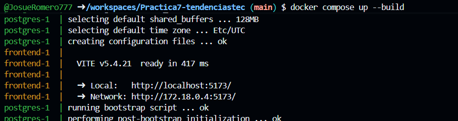
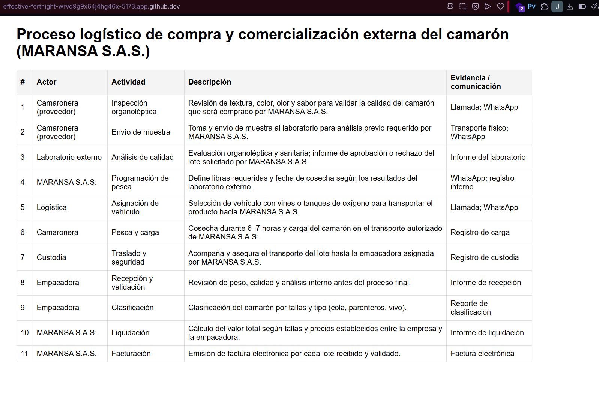

1. Título
Práctica: Contenerización de una aplicación frontend con React y consumo de datos desde una API REST (Postgres + Node/Express)
2. Tiempo de duración
60 minutos
3. Fundamentos
La contenerización permite empaquetar aplicaciones y sus dependencias en unidades aisladas llamadas contenedores. Cada contenedor contiene todo lo necesario para ejecutar un servicio (bibliotecas, runtime, configuraciones), lo que facilita la portabilidad y reproducibilidad en diferentes entornos. Docker es la tecnología más utilizada para contenerización: define imágenes (plantillas inmutables) y contenedores (instancias en ejecución).
En esta práctica se usan tres roles principales: base de datos (Postgres), backend (Node.js + Express) y frontend (React + Vite). Postgres actúa como almacenamiento relacional; se inicializa con un script SQL (`init.sql`) que crea una tabla `procesos` y la siembra con los registros del proceso logístico del camarón. El backend expone una API REST simple (`GET /api/procesos`) que consulta Postgres y devuelve los registros en formato JSON. El frontend (React) consume esa API con `axios` y muestra los datos en una tabla. La orquestación se realiza con `docker-compose`, que crea una red de servicios, permite resolver contenedores por nombre (p. ej. `backend`) y levantar todos los servicios con un único comando.
Conceptos relevantes:
- Imágenes y contenedores: una imagen es una plantilla inmutable; un contenedor es la ejecución de una imagen.
- Redes de Docker: los servicios en el mismo `docker-compose` comparten una red por defecto; se comunican usando el nombre del servicio.
- Volúmenes y persistencia: para mantener datos entre reinicios, Postgres usa volúmenes o carpetas montadas; en esta práctica se usa un script de inicialización.
- Proxy en desarrollo (Vite): al servir el frontend desde el dev server de Vite, se configura un proxy para reenviar `/api` al backend y así evitar problemas de Mixed Content o CORS durante desarrollo.
Figura 1-1. Diagrama de contenedores y flujo de datos (Postgres → Backend → Frontend)

4. Conocimientos previos
Para realizar esta práctica el estudiante necesita tener claros los siguientes temas:
- Comandos básicos de Linux (navegación, edición y permisos): `ls`, `cd`, `cat`, `vim`/`nano`, `chmod`, `chown`.
- Manejo de terminal y shells (bash).
- Fundamentos de Docker y Docker Compose: construcción de imágenes (`Dockerfile`), `docker build`, `docker run`, `docker compose up`.
- Conocimientos básicos de redes (puertos, host/localhost).
- Node.js y npm: instalar dependencias, ejecutar scripts (`npm install`, `npm run dev`).
- Conceptos básicos de Express (rutas, middlewares) y SQL (tablas, `SELECT`).
- Uso de un navegador web para comprobar el frontend y herramientas de desarrollador (DevTools).
5. Objetivos a alcanzar
- Implementar contenedores para un backend, frontend y base de datos (Postgres) usando Docker Compose.
- Exponer una API REST (`/api/procesos`) que devuelva datos desde Postgres.
- Construir un frontend en React que consuma la API y muestre una tabla con los procesos logísticos.
- Resolver problemas de desarrollo típicos (CORS, Mixed Content) mediante proxy de Vite y rutas relativas.
- Documentar el procedimiento y evidencias de ejecución.
6. Equipo necesario
- Computador con sistema operativo Windows, Linux o macOS.
- Docker Desktop o Docker Engine + Docker Compose instalados.
- Node.js (versión 18+ recomendada) y npm para desarrollo local opcional.
- Navegador web moderno (Chrome, Firefox).
- Editor de código (VS Code recomendado).
Requisitos de software (ejemplos):
- Docker Engine 24.x (o Docker Desktop 4.x)
- Node.js v18.x
7. Material de apoyo
- Documentación oficial de Docker: https://docs.docker.com/
- Guía de Docker Compose: https://docs.docker.com/compose/
- Express (Node.js): https://expressjs.com/
- Vite: https://vitejs.dev/
- Postgres: https://www.postgresql.org/docs/
- Cheat sheet Linux y comandos básicos (varias fuentes en línea).
8. Procedimiento (paso a paso)
Paso 1: Clonar el repositorio y abrir la carpeta del proyecto.
```bash
git clone <repo-url>
cd Practica7-tendenciastec
```
Paso 2: Revisar la estructura del proyecto: `backend/`, `frontend/`, `docker-compose.yml`, `img/`.
Paso 3: Construir y levantar los servicios con Docker Compose.
```bash
docker compose up --build
```
Paso 4: Verificar que Postgres está listo y que el backend imprime en logs: `Backend listening on port 4000`.
Paso 5: Abrir el frontend en el navegador en `http://localhost:5173` y confirmar que la tabla carga datos.
Paso 6: Capturar evidencias. Las siguientes imágenes son las evidencias generadas durante la práctica:
Figura 8-1. Frontend en ejecución mostrando la información consumida desde la API (evidencia).

Figura 8-2. Resultado del build/compose (logs y ejecución de contenedores).

9. Resultados esperados
Se espera obtener los siguientes resultados:
- Postgres corriendo y la tabla `procesos` inicializada con los registros del proceso logístico.
- Backend escuchando en el puerto `4000` y respondiendo en `/api/procesos` con JSON.
- Frontend (Vite) en `http://localhost:5173` mostrando una tabla con todos los registros obtenidos desde la API.
Capturas de ejemplo: la evidencia `img/fronted.png` muestra la tabla en el navegador; `img/build.png` muestra el resultado del `docker compose build` y contenedores activos.
10. Bibliografía
- Docker, Inc. (2025). Docker Documentation. https://docs.docker.com/
- PostgreSQL Global Development Group. (2025). PostgreSQL Documentation. https://www.postgresql.org/docs/
- Express.js. (2025). Express - Node.js web application framework. https://expressjs.com/
- Vite. (2025). Vite documentation. https://vitejs.dev/
- Linux Foundation / various. (2025). Linux command line cheat sheets.


